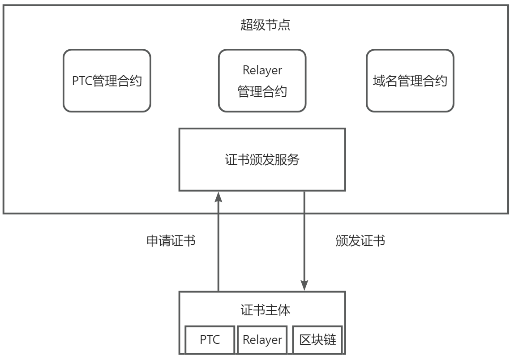

<div align="center">
  <h1 align="center">BCDNS Credential Server</h1>
  <p align="center">
    <a href="http://makeapullrequest.com">
      
    </a>
    <a href="https://www.java.com">
      
    </a>
    <a href="https://www.apache.org/licenses/LICENSE-2.0">
      
    </a>
  </p>
</div>

# 介绍
区块链域名系统（BlockChain Domain Name System, BCDNS），是按照[IEEE 3205](https://antchainbridge.oss-cn-shanghai.aliyuncs.com/antchainbridge/document/ieee/p3205/IEEE_3205-2023_Final.pdf)跨链标准中的身份协议实现的证书颁发服务，负责给跨链系统中的证明转化组件（PTC）、中继（Relayer）、和区块链域名赋予唯一性标识和可信证书，以实现跨链互操作过程中的身份认证。

BCDNS将功能实现分为两部分，分别为凭证颁发和凭证上链，PTC、Relayer和区块链域名主体等在发起证书申请后，由发证方负责审核并颁发证书，同时证书信息会由发证方上传至星火链证书管理合约（PTC管理合约、Relayer管理合约、域名管理合约）中记录。

# 架构




区块链域名系统向网络提供权威服务，包括域名签发、跨链身份凭证、网络路由等功能。

- 证书颁发服务：证书颁发服务是由星火·链网超级节点负责运行的一个链下服务，为PTC、Relayer、域名颁发VC。
- 证书主体：VC针对的主体，用bid地址唯一标识。
- PTC管理合约：存储PTC发证方颁发的数字证书列表。
- Relayer管理合约：存储Relayer发证方颁发的数字证书列表，以及域名和Relayer的路由映射关系、域名和TB-BTA的映射关系。
- 域名管理合约：存储区块链域名发证方颁发的数字证书列表。

# 快速开始

## 部署BCDNS

### 环境

BCDNS使用了MySQL和Redis，这里建议使用docker快速安装依赖。

首先通过脚本安装docker，或者在[官网](https://docs.docker.com/get-docker/)下载。

```bash
wget -qO- https://get.docker.com/ | bash
```

然后下载MySQL镜像并启动容器：

```bash
docker run -itd --name mysql-test -p 3306:3306 -e MYSQL_ROOT_PASSWORD='YOUR_PWD' mysql --default-authentication-plugin=mysql_native_password
```

然后下载Redis镜像并启动容器：

```bash
docker run -itd --name redis-test -p 6379:6379 redis --requirepass 'YOUR_PWD' --maxmemory 500MB
```

### 构建

*在开始之前，请您确保安装了maven和JDK，这里推荐使用openjdk-1.8版本*

进入代码的根目录，运行mvn编译即可：

```bash
mvn clean package -Dmaven.test.skip=true
```

在`bcdns-credential-server/target`下面会产生压缩包`bcdns-credential-server.zip`，将该压缩包解压到运行环境即可。

### 配置

在获得安装包之后，执行解压缩操作：

```bash
unzip bcdns-credential-server.zip
```

进入解压后的目录，可以看到：

```
cd bcdns-credential-server/
tree .
.
├── bin
│   ├── launch
│   ├── launch.bat
│   ├── wrapper-linux-x86-64
│   └── wrapper-windows-x86-64.exe
├── conf
│   ├── application-dev.properties
│   ├── application.properties
│   ├── application-pro.properties
│   ├── application-test.properties
│   ├── contract
│   │   ├── DomainNameManager.sol
│   │   ├── PTCManager.sol
│   │   ├── README.md
│   │   ├── RelayManager.sol
│   │   └── utils
│   │       └── Ownable.sol
│   └── wrapper.conf
├── lib
│   ├── antchain-bridge-commons-0.2.0-SNAPSHOT.jar
│   ├── ....

```

## 部署合约

要部署的合约一个有三个，PTCManager.sol、RelayerManager.sol和DomainNameManager.sol，合约代码在`src/main/resources/contract目录中`。合约部署是将以上3个合约部署到星火链测试网上。

首先需要一个星火链账户拥有星火令才能正常往链上部署合约，测试网星火令可以通过[星火插件钱包](https://bif-doc.readthedocs.io/zh-cn/1.0.0/tools/wallet.html)申请**星火个人数字凭证**，待审核通过后（一周会审核1到2次，也可用通过加入星火开发者社区，请求快速审核），即可获取`100`星火令。

然后使用星火合约编辑器编译、部署合约到星火测试网上。其中部署过程中需要用到第一步用于星火令账户的私钥，可以在插件钱包中导出。星火合约编辑器使用说明请参考`/src/main/resources/contract/Remix合约IDE星火插件.pdf`

## 修改配置

配置文件在`conf`目录下，开发者使用`application-test.properties`进行配置的修改。需要修改MySQL、Redis的用户名和密码，源码test目录下的辅助工具`ConfigToolsTest`可以帮助加密密码，并生成解密公钥；同时修改三个合约地址，以及超级节点和发证方的私钥，对于体验模式，没有对超级节点进行校验，可随意填写一个账户私钥，发证方的私钥则需要填写部署合约时用到的账户地址的私钥。

`ConfigToolsTest`使用返回结果示例：

```
password:123
privateKey:MIIBVQIBADANBgkqhkiG9w0BAQEFAASCAT8wggE7AgEAAkEAwTVOAt46/utkxf0tbpAtD9GpOlurccJeKvde79OVmJVAXr/GDECwu39fxGEGmpNdSjRM5H++czqtoC+mdi8Y9wIDAQABAkAs4y9+pxbZxuKgxRNbDpAJjtJcRpPsWBX8sYATA/tLeWohl7q/I6IY27t/PLKPS9zmfH+WbMOk0O0jE0L4yuLRAiEA4oRWlliMvm4PffwEKJOyitwNu9S0x/+GV7HOSwnM25sCIQDaWxpCP9Gm1f92QweX6lJxeokO1/dzHPi7r33fK/2z1QIhANd4dXk8sF0xCrGX+kiy/oKSgsnqszEQQzXGIGtG3kUDAiEAgSTKtg4ayErfKanhTtc25YjskQvofXvQHOlhT+IrzfUCIA39R39d0/ogujRVQ/B4s2gIunvUzERcyDoNrK2sArWC
publicKey:MFwwDQYJKoZIhvcNAQEBBQADSwAwSAJBAME1TgLeOv7rZMX9LW6QLQ/RqTpbq3HCXir3Xu/TlZiVQF6/xgxAsLt/X8RhBpqTXUo0TOR/vnM6raAvpnYvGPcCAwEAAQ==
password:iq7fRgyw261DckmzRlnWV9QzrNVjtpDV0GwkpogoB60ctO2HINf47qWq599yTb+oNkHkbTRzpGvk6zqC6Klyxg==
```

配置文件示例：

```properties
server.port=8114 //服务端口号
logging.level.root=info

spring.datasource.url=jdbc:mysql://127.0.0.1:3306/bcdns?useUnicode=true&characterEncoding=UTF-8&serverTimezone=GMT%2b8&useSSL=false //mysql配置
spring.datasource.username=xxx //mysql用户名
spring.datasource.druid.filter.config.enabled=true
public-key=xxx //非对称加密公钥，用于解密mysql密码，在源码src/test/java/org/bcdns/credential文件夹中有辅助工具ConfigToolsTest可以帮助加密mysql密码并生成解密公钥
spring.datasource.druid.connection-properties=config.decrypt=true;config.decrypt.key=${public-key}
spring.datasource.password=xxx //加密后的mysql密码
spring.datasource.druid.initial-size=1
spring.datasource.druid.min-idle=1
spring.datasource.druid.max-active=20
spring.datasource.druid.max-wait=60000
spring.datasource.druid.validation-query=select 1
spring.datasource.druid.time-between-log-stats-millis=1800000
spring.mvc.servlet.load-on-startup=1

redis.host=127.0.0.1 
redis.port=6379
redis.password=xxx //加密后的redis密码
redis.publicKey=xxx //非对称加密公钥，用于解密redis密码，在test文件夹中有辅助工具ConfigToolsTest可以帮助加密redis密码并生成解密公钥

dpos.contract.address=did:bid:efRH1Lbsuqwc6jRw3hK4H5Hp2RhHnryS 
ptc.contract.address=xxx //完成合约部署后得到的PTC合约地址
relay.contract.address=xxx //完成合约部署后得到的relayer合约地址
domain-name.contract.address=xxx //完成合约部署后得到的r域名合约地址
sdk.url=http://test.bifcore.bitfactory.cn 
object-identity.supernode.bid-private-key=xxx //星火链测试网超级节点私钥，体验模型可以随意填写一个账户私钥
object-identity.issuer.bid-private-key=xxx //部署合约时使用的账号私钥

run.type=0 //BCDNS服务运行模式，0为开发者体验模式，1为实际生产模式；生产模式和体验模式区别在于对于凭证申请的权限校验，实际生产模式，PTC的申请规定只能容许骨干节点有资格，Relayer的申请规定只能容许超级节点有资格，而体验模式为了简化流程，省去权限校验部分。
```

## 运行

运行数据库脚本来创建表单，数据库创建脚本为`src/test/resources/init.sql`，将其拷贝到MySQL容器中，登录容器并执行脚本：

```sql
mysql> source init.sql;
```

数据库表单创建成功后，在`bcdns-credential-server`解压包根目录之下，运行一下命令即可：

```bash
./bin/launch start
```

日志文件存储在`logs`目录之下，通过日志查看到下面的输出即BCDNS服务启动成功：

```
2023-12-27 09:55:20.991 INFO 23020 --- [main] o.s.b.w.embedded.tomcat.TomcatWebServer: Tomcat started on port(s): 8114 (http) with context path ''
2023-12-27 09:55:21.003 INFO 23020 --- [main] o.b.credential.CredentialApplication: Started CredentialApplication in 4.727 seconds (JVM running for 6.086)
```

可以通过`./bin/launch stop`关闭服务。

# 社区治理

欢迎您参与[开发者社区](https://bif-doc.readthedocs.io/zh-cn/2.0.0/other/开发者社区.html)进行讨论和建设。

# License

详情参考[LICENSE](./LICENSE)。